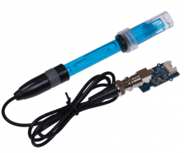
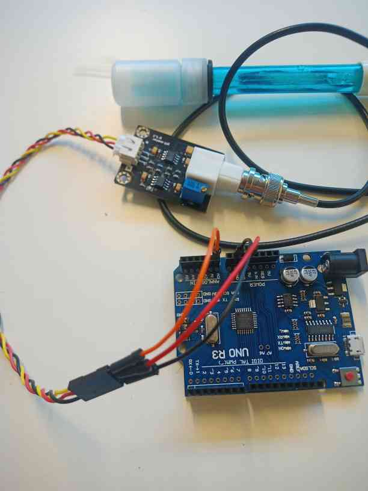
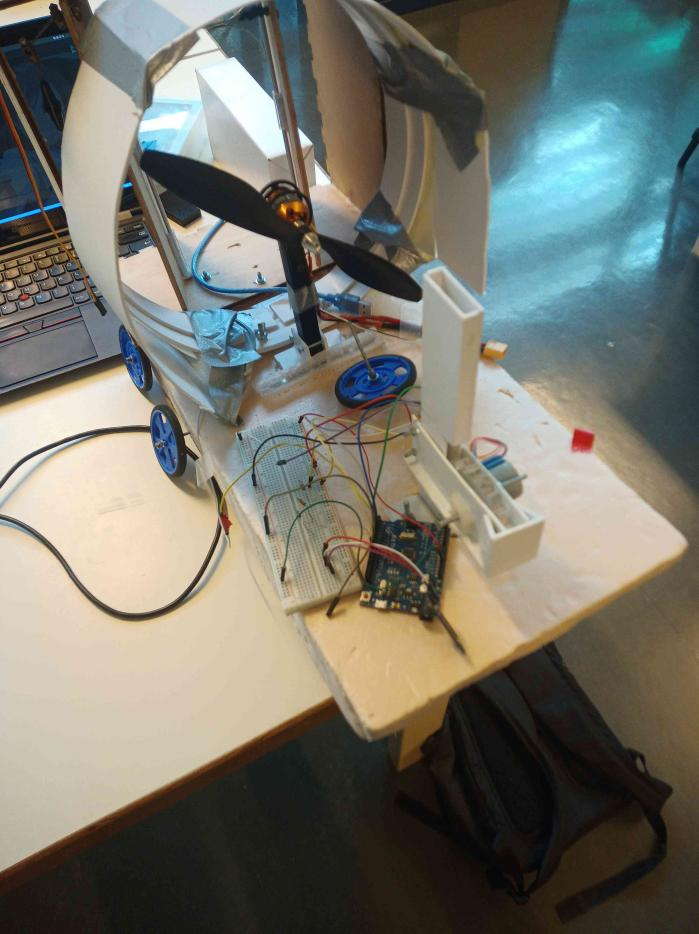
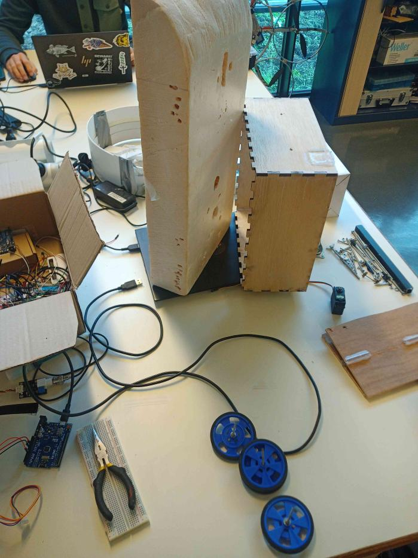

First report -- 14/10/2022
=========================

Task according to the Gantt chart :

* Discover sensors
* Code for sensors

I chose to use the pH sensor.
It is the [Grove – pH Sensor Kit](https://www.seeedstudio.com/blog/2020/05/14/measuring-ph-with-an-arduino-and-ph-sensor-arduino-tutorial/), and it uses the library `"phgrav.h"`.
It doesn't use any timers, so it shouldn't have conflicts with other libraries.
The pinout isn't hard either, so this sensor seems good.

It seems to work pretty well, but I have to calibrate it if I want a high precision. I don't have the samples for calibration yet, so I'll do it later.

The average pH in the oceans is 8.1, and decreases with time, since the concentration of CO2 increases.
So I should use calibrating samples of a pH of 7 and 10.
However, I have only found calibrating samples of 4 and 7 on the web.

Then I dismantled the previous hydrofoil project. I couldn't find his github repository, but here is a picture of how it looked like :

And now, it is dismantled :

We could use its shell, but we well compare it with other types of shells, when we will do them (in two weeks).

Nathan has also taken the brushless motor, and the ESC, and wanted to test them.
I have chosen a better ESC, and we will test them next week.
