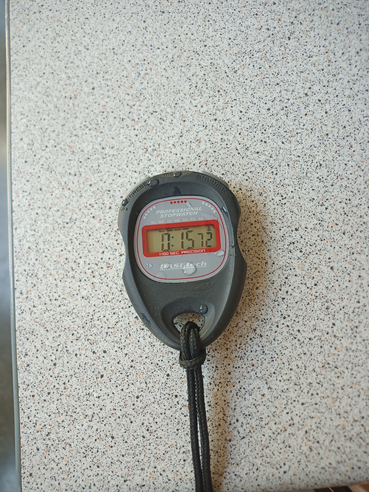
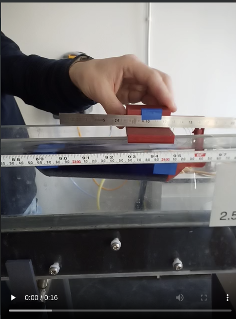
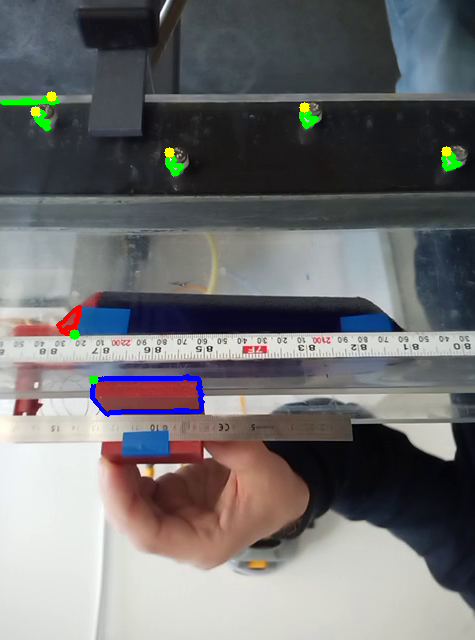
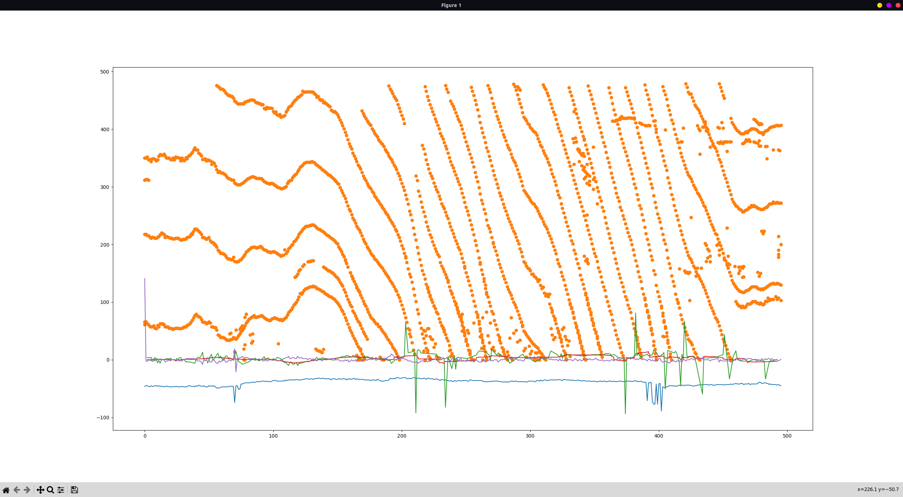
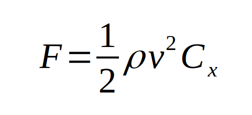
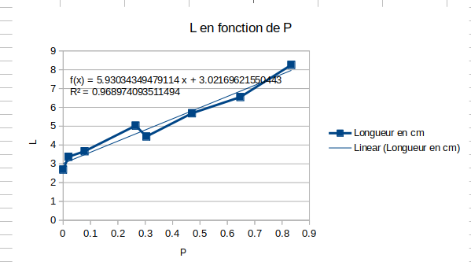
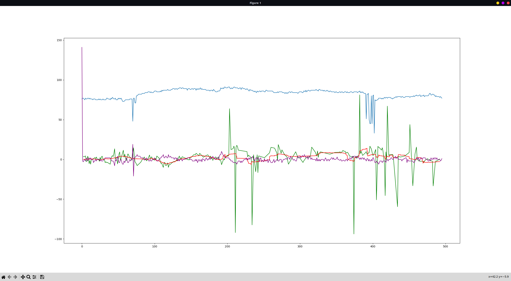

# Twelfth and Thirteenth Report -- 14/2/2023

I made the drag test that I talked about in the previous reports with M. Arkadii Schodenski(wrong spelling probably).
I filmed the two modules to study the force of water drag.
The videos are available here : [videos folder](images_and_videos_for_reports/temp_fishe/new)
The water flow in the canal was 10L in 15.72s (see picture of the chronometer, we  measured the time necessary to fill a 10L bucket), giving an average water speed of 12cm/s, given the area of the canal.
Normally it should be proportional to  the water's height, but to make it simpler, we decided to keep it constant.

12cm/s isn't enough to measure a force via the spring, so we had to move the modules to add a second speed, up to approximately 50cm/s. With such speed, the force can easily be seen between the modules. But the precise speed is very hard to compute...

So I have done a video analysis program, given the input of a video, it finds precise areas to plot the value I need.

Here is an example frame of the video :

Since we want to measure the spring's length, we just need to find the position delta between the two modules. So we need their relative position. We can identify them by two *easy* ways:analyzing the turquoise blue tape pieces, or the brown-red 3d printed pieces. The blue analyze would be easier since there is no close color around, but in some videos, Arkadii holds the module with a finger on the tape, so a lot a data would be loss.

So I had to go for the red analysis, although the red is quite spread in the video.
I started searching pure brown, picked up in the middle of the video, but because of the brightness changes, it didn't reallywork. I had to increase the filter's tolerance a lot to keep the two module in the whole video, and it made me see other things, like Arkadii's hand, and the reflects on the ruler. But this noises can be eliminated with other treatment. I isolated the filter's results as contours with a length and an area in pixels, and only kept bigger ones. Then I only needed to keep the closer from the bottom right hand corner with areas above respectively for the modules 300 and 1000 pixels. (this contours are in the next image, in red and blue)

With the right contours, I just had to plot two fixed points, I chose the closest possible points to decrease errors. They are on the next image, in green.

*the image is reversed, don't ask why*

You can see the contours and the points on this image.

The other yellow points and green shapes are used to measure the speed of the camera according to the canal. I found them by searching white objects above the height of 300px. If I can measure their x-position over time and derivate it, I'll get the actual speed of the phone filming. Then I need to subtract the speed of the modules (in the camera's reference frame), to get the speed of the modules in the canal's reference frame.

I already have the position of two fixed points on the module, I just need to derivate it to find the speed.

Here is my final result : 

The blue line is the position delta between the modules(with some errors, I should smooth it), the purple line is the speed of the module in the canal's reference frame, the orange points are the coordinates of the yellow points above to measure the speed, the green line is their derivative, without extreme points because it was sometimes way too high, so I removed the problems. The red line is the sum of the green and the purple lines, smoothed, so it is approximately the speed of the modules in the canal.

We know that the force is as follows : 

And for the spring, we have : 

See [the spreadsheet here](/Models/ressort.ods)

We don't have the same equation, since my program gets the distance between two fixed points of the modules, and not the spring's lenght, but I just have to add a constant to correct it.

Here is what I finally get : 

The lines are still the same thing, but I edited the blue line to be the spring's length in pixels.
We can see a problem in the red line too : it seems to only follow the green line, where it should sum the purple and green lines...
Now I need to reverse my equation, make a square root, and I'll have my precious drag coefficient!

I have also solved the ports proble of the web server on the jetson nano; the problem was the framework, it was in debug mode, so it was only visible on localhost, and it was impossible to reach it from another ip adress. Now I have corrected it, I can access it through the web, still only if I am on the same network, but that's a lot of progress!

