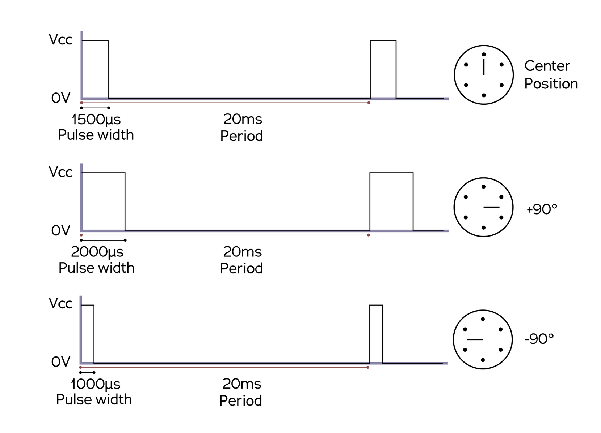

# Sixteenth report -- 13/03/2023

I tried to assemble the shell and the propeller with Nathan this week.
I screwed the bottom of the propeller in the shell, since Nathan designed a vertical part on the propeller specifically for that. It screwed it directly in the shell, so the plastic of the shell just got penetrated, and the screw got fixed with the expansive foam. It held very well, but I had put the propeller in the wrong direction, so I had to remove it. But the screws were stuck due to the moss's elasticity, so it was impossible to remove two of them. I had to cut a part of the shell... It's not very important, but it could cause vulnerabilities in the future. I'd prefer not having to print a new one, I'll do my best with this one...

Then I tried to activate PWM on the Jetson Nano to control the servo and brushless motors(We found a website explaining this several months ago, but it was not really necessary immediately)

Passive PWM is not enabled by default on the Jetson Nano, but, at least, one pin is PWM-capable(33 on board). However, it is also an analogic input pin, and is used so. So we need to change the jetson nano pin configuration to change pin 33 to be pwm. To do so, we need to replace the pin configuration file in the jetson nano settings, and to re-install the OS. But... we can't since Auvidea won't let us do so(the file we need to edit changes from one version of the jetson nano to another, and it also holds the jetson nano USB and HDMI pinout, so a wrong change could make the jetson nano unusable, and the usb on the Auvidea JN30D isn't the same as the one on the nvidia jetson nano, so sending nvidia's file is highly risky, and we don't have auvidea's file).

PS : I noted new versions of the Nano have a second PWM-capable pin, enabled by default

So we can't do passive PWM, but we could try active PWM. I made a [program](../../Codes/fishe_manager/act_pwm_motot.py) to control PWM for a servo motor, like the Servo library in python, using asynchronous calls to the Jetson Nano's GPIO pins. Here is a chronogram of what should be done:


But because of Python's slowness, my PWM signal is a bit offset : 
```py
tobj:0.00185
treal:0.0018553733825683594
0.020001649856567383
```

The first line is the theoretical delay for the HIGH value, for an angle of 63°. The second one is the one observed. We can note there is approximately 5µs more, meaning an actual angle around 63.9°. This could be corrected, since it seems to be a constant offset between all test angles, but this time currently includes the time measurements, and I don't know how to measure how long it takes to measure it, so I'll maybe correct it later, but it's not a priority.

The third line is the frequency of the PWM signal, so it means 50Hz and around 0.01% of duty cycle error. It's not perfect, but it's not bad either.
I don't think it will change the behavior of the motor.


I tested my program with a basic servo motor, and it seems it worked, but I didn't have a way to measure the angle, so I can't be sure. I'll try to test it with the brushless motor later.