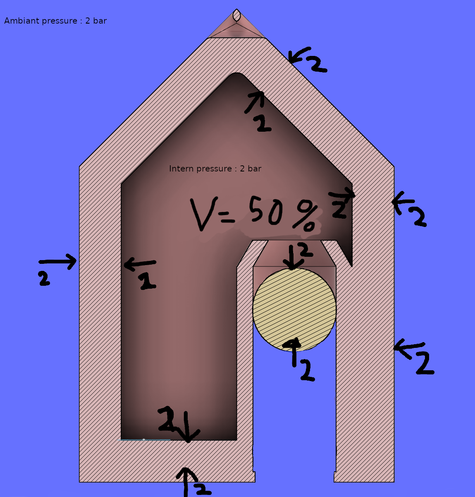

# Nineteenth report -- 04/04/2023

I started to work on the probe shell. The are two major problems to solve : watertighness and pressure resistance.
The possible solutions for pressure resistance are :

* Use a material that is resistant to pressure
* Fill the shell with a liquid, like insulating oil
* Fill the shell with resin
* Use a cotter pin to equilibrate the pressure between the outside and the inside of the shell using a marble

The first solution isn't viable, since making the shell harder means less watertighness.

The second seems quite a good idea.

The third solution is a good compromise since it is supposed to insulate the probe perfectly, but it is impossible to disassemble the probe without breaking it.

I chose to use the fourth solution for now, and I'll see if it is effective or not.

To make the cotter pin work, I must make it big enough to compensate pressure differences. For example, if the shell is at atmospheric pressure, and it goes down 10 meters underwater, the pressure outside will be twice bigger than the pressure inside, so the cotter pin must be filling at least half of the probe shell's air volume.

Explanations :

First step : the shell is in the air, so the pressure inside is the same as the pressure outside.
No force is applied on the marble inside the cotter pin.
The pressure inside and outside are compensated.

Second : the shell goes down 10 meters underwater.
The pressure outside is twice bigger than the pressure inside.
There is a force applied on the marble inside the cotter pin, and it is pushing it to the inside of the shell.
(note : all the shell is pushed, but we consider it as a rigid body, which is unfortunately not the case)

Third : the marble in the cotter pin has moved upwards, so the volume of the shell is lower. The perfect gaz equation tells us that if the temperature is constant, the pressure is inversely proportional to the volume.
So to reach pressure equilibrium, the volume inside must be twice smaller than before.

That's why we need the cotter pin to be 50% of the shell's volume.

However, we want the probe to go down to 100 meters, so we need the cotter pin to be 1-1/11 = 91% of the shell's volume.
So the shell's space must really be well optimized.

The advantage of this approach is that the only part that needs to be watertight is the cotter pin.

I printed a little one to test it, and water without pressure couldn't go through it, both with PETG and flex wire.

I don't know if it will hold with 11 bar though.
