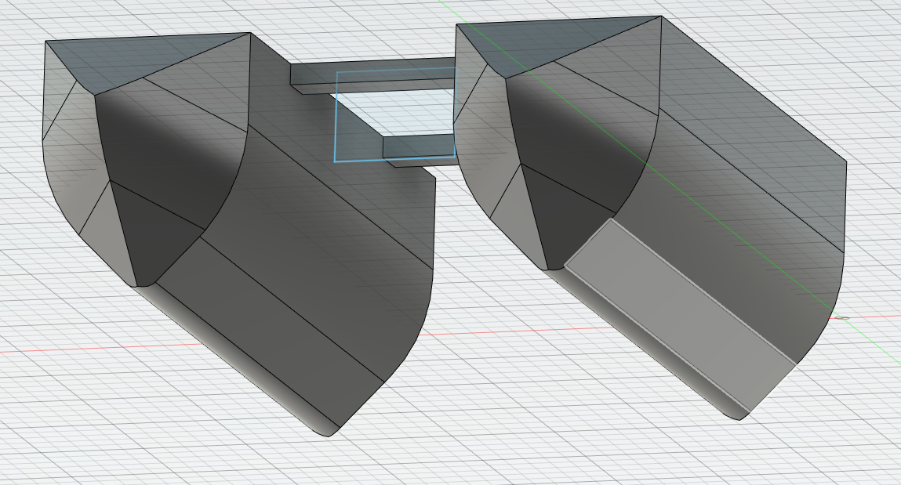
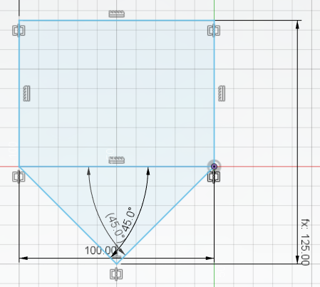

Second report -- 18/10/2022
===========================

Task according to the Gantt chart :

* Combine sensors

This week, I first combined the codes of the two sensors(pH and temperature). I had no major conflicts, since they don't use interruptions, timers, or anything else susceptible of modifying the arduino board's beheviour.
The merged code can be seen [here](../../Codes/Test/cours2/src).

Then I started next week4s task, aka the shell modelization on Fusion360.
I started by the catamaran shell.

Here is its cut view:

I added some fillets.
The problem of this shell is that algae could get stuck on it, so we'll have to find a way to prevent that.
