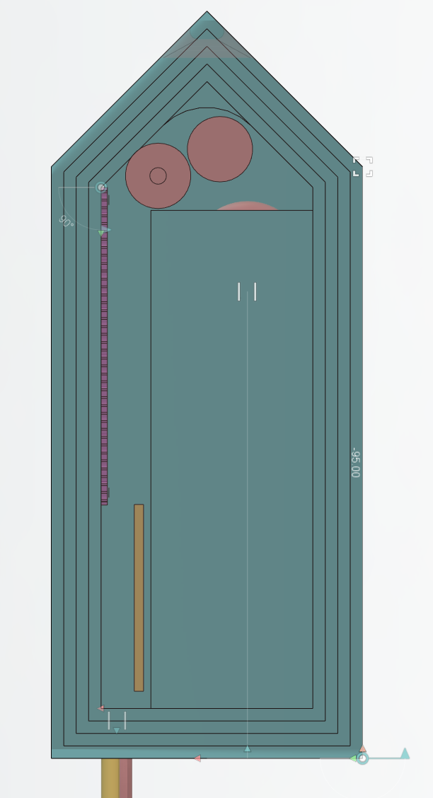
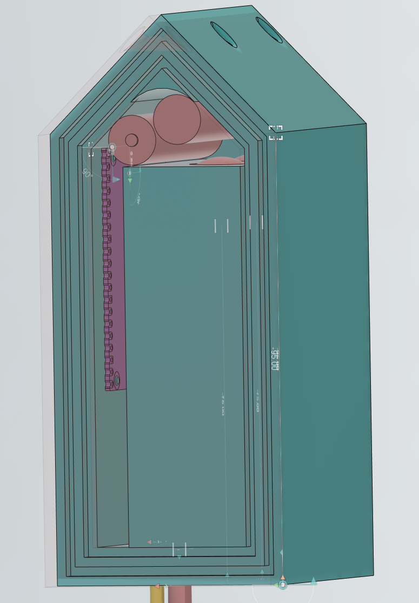
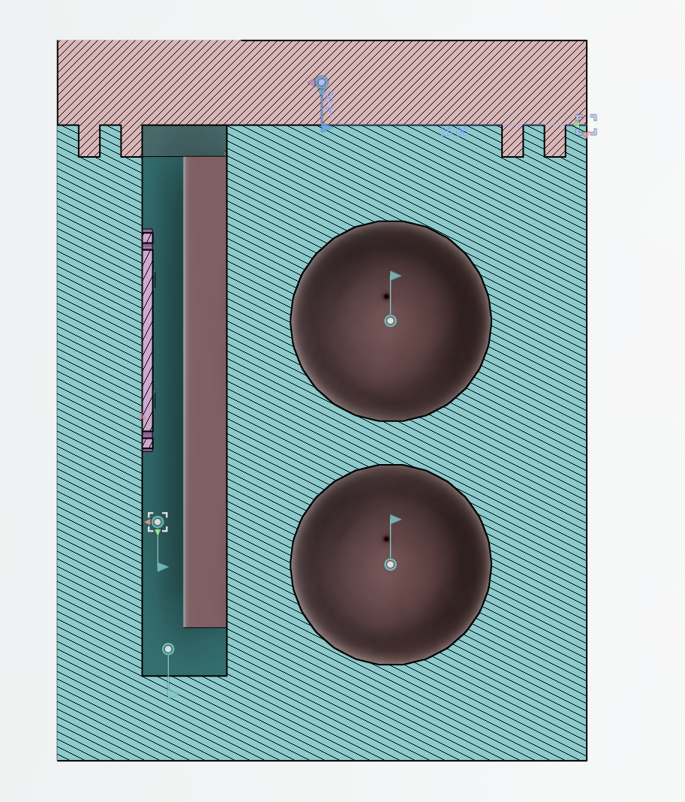
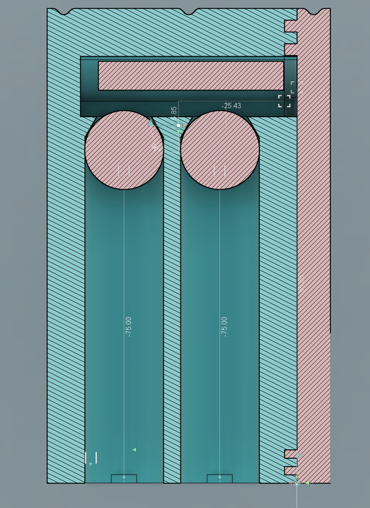

# Twentieth report -- 11/04/2023

## ROS

As we start to see the deadline, I wonder if it is really necessary to use ROS...
From what I've learned by doing the tutorials, I really think it is a nice framework, and it is really adapted to the use we want here with the Jetson Nano. However, as our project moves on water and we don't have the exact data for simulation, we can't just use simulators in parallel to ROS. I could be done, but would require much work. On the other hand, I think it could be a good idea to use the *nodes* part of ROS:
In ROS, each component of a robot is a node, meaning, in our case, that we would have a node for the propeller, a node for the rudder, a node for the probe, etc. The main strength of ROS is, in my opinion, the communication between the nodes, and the management of connection problems, like if a wire disconnected, which would be lethal for a robot without securities. It would need a bit of time to migrate the existing programs to ROS, but not so long since they are already in object style in Python. I will maybe do it if I have the time, but it's not a priority.

## Shell

The shell's modelization is in progress. I made it fully parametrized to make it easier to edit.
The main modifications I made are :

* The shell is a lot thinner. The inner volume is around the same as the cotter pin's volume, meaning the probe can go safely underwater above -10m., with an internal pressure around 2 bar.

Here, the shell is the blue part. The lid is the transparent pink part.
The seal closing the lid consists on two nested sills of 2mm-3mm-2mm to make sure it is watertight.
The shell is 8mm thick. I made this choice to make sure the shell is strong enough to resist to the pressure of the water.

In this cross section view, we can see there is also 8mm around the marbles.
We can also see there is still a lot of space to fill where there are the electronic cards, but I will leave it this way for now to make it easier to assemble the probe.
I made some hooks for the raspberry pi pico and some other are planned for the sensors and the cells.

Here, we can see the cotter pin's inside. I switched to an approach with two marbles to maximize the volume. I also changed their diameter.

The purple part is the raspberry pi pico, the yellow one is the ph sensor's board. The pH probe is way too big to fit in the probe, so it will be outside. The other sensors are below the probe. They are currently the yellow and pink cylinders on the bottom of the picture.

The cells are the pink cylinders on the designs, they are currently AAA cells but as explained later, I'll switch to more compact ones.

* I chose to use button cells for the power supply, any external battery is way too large, and the voltage of button cells(3V) makes the volumetric voltage really high, in contrary to standard cells. I could also use a LR23(I saw one in a shop, it is a bit tinier than a AAA cell, but 12V).

The raspberry pi pico can be powered in any range between 1.8V and 5.5V, making it really easy to use. If we only needed it, a single button cell between the pico's GND and VSYS would be necessary, resulting on 3V on VSYS. However, we have sensors that require a higher voltage to work, and if this voltage isn't precisely 5V, we lose a lot of accuracy on the measures.
Because of this restrictions, we need to use one more cell to reach 6V and a tension regulator.
However, the regulators are generally not very precise, and it would be hard to use. Another option would be to use another board like an arduino for power regulation. For example, an arduino nano can take any voltage input between 7V 12V and make it a fixed voltage. The minimum of 7V is because of the regulator's loss, because of a Schottky diode in the regulator. In our case, it would require a third button cell to reach 9V, but it is still possible.
The best solution would be to find button cells with a different voltage to make a voltage input between 3.3V and 5.5V, and to use sensors that work in 3.3V.

## Connection between the pico and the nano

I managed to make a *mobile hotspot* on the nano and to connect to it with my phone, I am almost done with this part!

The data transfer program is almost done, I just need to wrap things up.
 