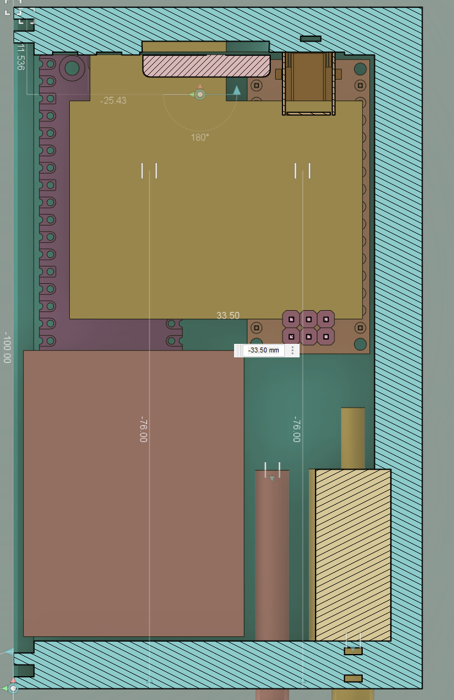
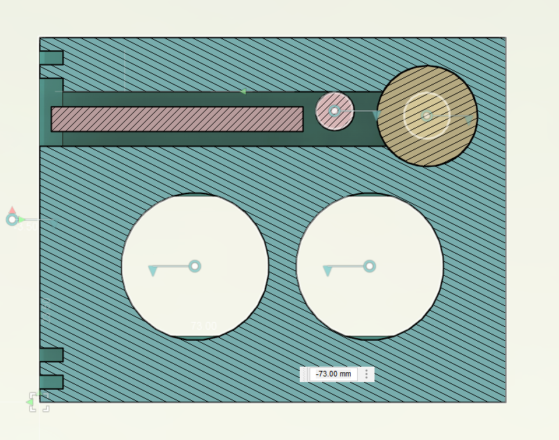
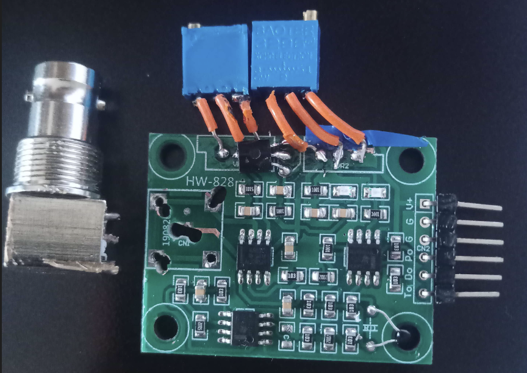
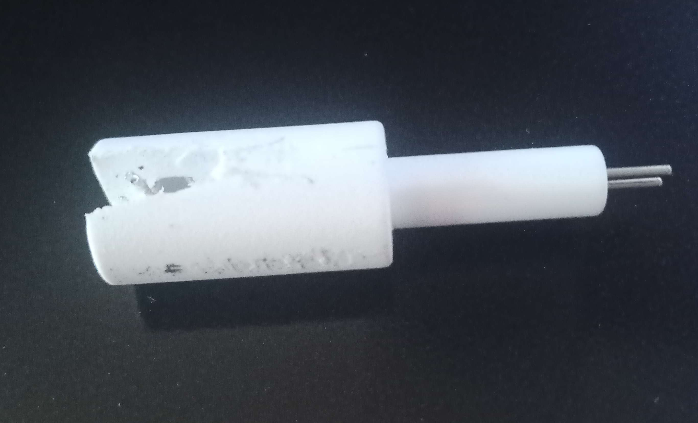
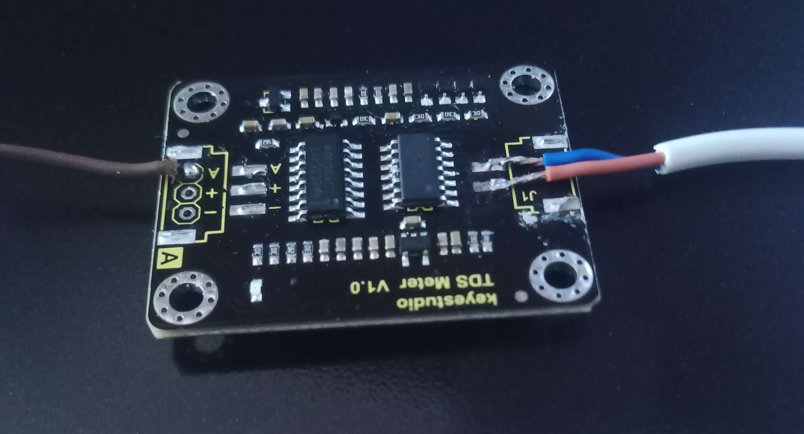
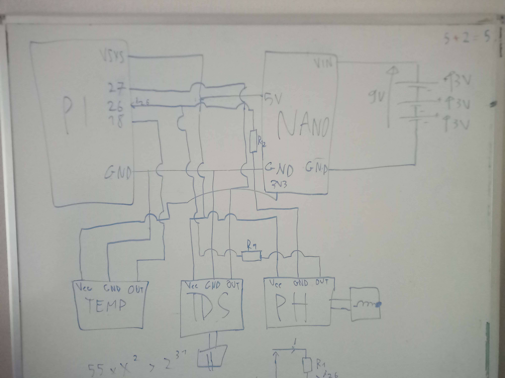
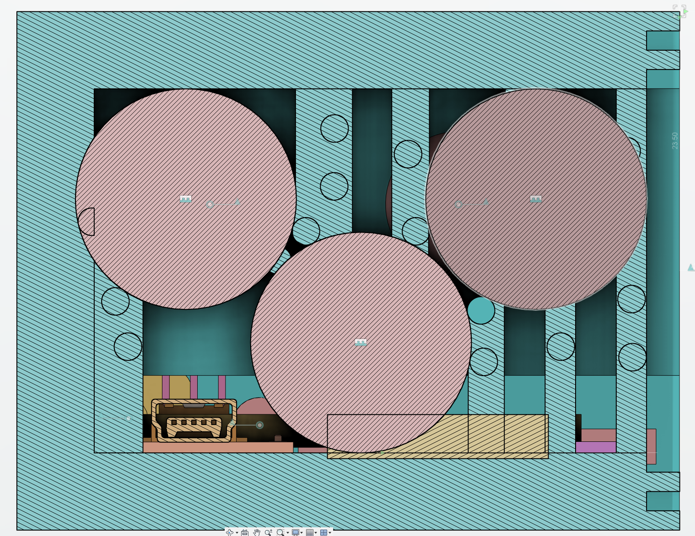

# Twenty-first report -- 25/04/2023

This week, I worked mostly on the shell.

## Fitting everything in the shell

I modified my design to fit all the sensors, the raspberry pi pico and the arduino nano.

Here, we can see the projected area of the inside and the one of the cotter pin. We can approximate the area ratio around 1.78 without the sensors, and around 3 with the sensors. So the shell could go approximately 30m underwater without having any pressure exerted on it. However, this is a very rough approximation, and I don't know if it is correct.

I had to modify the sensors since they were too big and really not optimized for my design, since it is really thin. So I removed the pH-meter's probe connector and will solder the wires directly to the board.
I also unsoldered the potentiometers on the side then connected them back with small wires to be able to move them on the side of the board:

I will solder the probe on the CN1 point.

I also removed the connectors of the TDS sensor, and modified the TDS probe because it is too big, I can't put it entirely in the shell, I have to insert it in the shell during 3D impression. The problem is that the wires go in the direction of the 3d printer nozzle, so it would prevent printing. I had to cut the probe to get the wires out of it.

The thermometer is fine, I'll just have to cut the wires because they are too long.

I also removed the usb connector of the arduino nano, and its reset button since they were too big.

## Electrical design

I chose to use an arduino nano as a regulator, so I have 3 button cells as input, and two voltage buses as output : 5V and 3.3V.

I have to power the pico, the TDS sensor, the pH sensor, and the thermometer.

The pico can be powered between 1.8V and 5.5V, so I could power it with the 3.3V bus. However, it would mean more current consumption, so I think it would be better to power it with the 5V bus.

The TDS sensor can be powered either in 3.3V or 5V, I will use 5V for the same reason. But its output is between 0V and 2.3V, so I won't have to use any voltage divider, I can plug its output directly to the pico.

The thermometer has a one-wire interface, so I can power it between 3V and 5V, but the output will have the same voltage as the power voltage(I think, I haven't found the answer), so I'll power it on the 3.3V bus.

The pH sensor must be powered on 5V, and its output is between 0V and 5V, so I'll have to use a voltage divider to plug it to the pico.

Here is the whole design(one resistor between the thermometer's interfaces is missing):

## Make the shell printable

I can't print the shell as it is, because it is too thin, and the 3d printer would print the top of the shell in the air, so I have to add some supports. Making the supports on Prusa slicer would prevent me from putting the cells for example, so I had to make the supports myself. I'm not sure if it will work, because I am far from the safe bridge length in most cases, but... we'll see.

