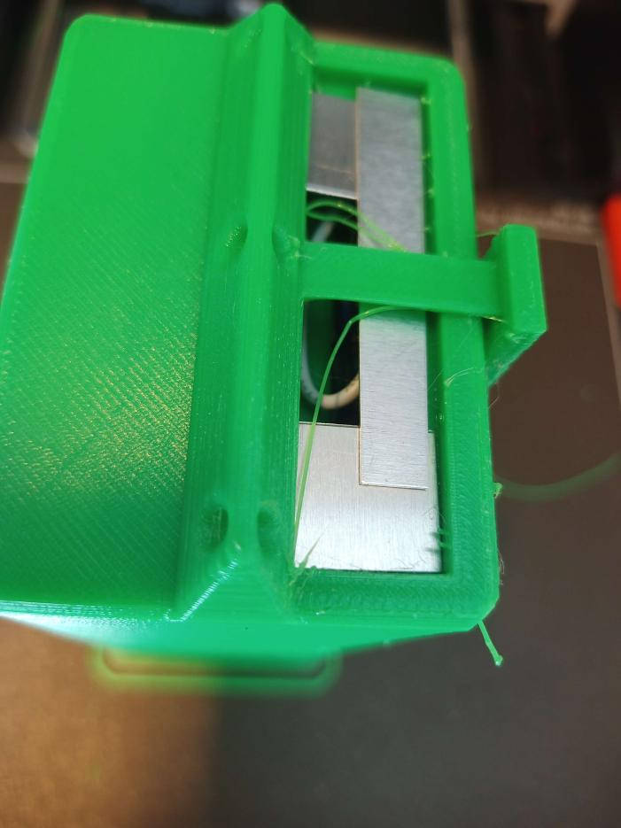

# Twenty-second report -- 02/05/2023

## Probe test

I made the electrical design to test if the probe worked correctly, and to make it launch correctly at startup. I also modified the Jetson Nano's launch script to make a demo of its capabilities.

## Probe shell

During the whole week, I printed the shell.
The 3D print itself was more 40 hours long, but there was some pauses in the middle of the print to put some supports or insert and solder the sensors.

I thought it could be possible to print directly on the cells at first, but the 3D printed plastic is at 240°C, and the cells only support 60°C, so I had to print the shell without the cells, and then insert them. This forced me to make a system to open and close the cell, while being waterproof.

I had to put metallic supports everywhere to make the printing possible. I also put some lacker on the metal to make it more adhesive, because the plastic didn't stick to the metal at first.

I had a problem with the ph meter though, the sensor's board didn't fit in the shell. It was supposed to be next to the arduino and raspberry pi pico, but I neglected the wires' thickness, so in the end, I couldn't fit it in.

Here is the final result, with the metallic supports still in place.
