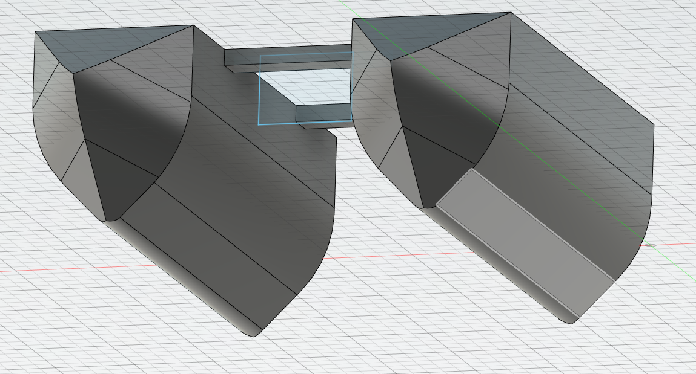

Third report -- 11/11/2022
==========================

Task according to the Gantt chart :

* Shells design

Last week, I modeled the catamaran shell, like this :

But I thought of a better idea for the shells, since they need to be light and strong. I decided to make them empty, and add an other shell inside. So, if the outside shell breaks, the boat will still float. So I had to find a way to connect the two shells together, and I decided to use little circular connectors.

The circles placement is important, since it will link the two shells. I will test the shell's strenght when it will be printed, but the print will last more than twenty hours, so I'll have to wait a bit.

The parameters I chose for impression are : 0% filling, 3 perimeters, no supports. It was only possible to print the shell without supports becauseit it a cut, but when I will add the front part of the shell, I will have to print it differently, because I can only print it vertically.
