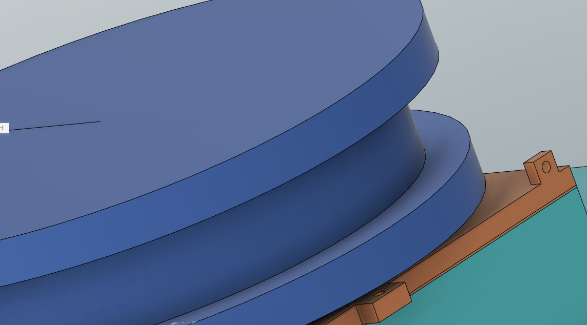

# Fifth report -- 25/11/2022

Task according to the Gantt chart :

* Simples designs around the shell

I have started to think how the shells should be attached together, because the force could be very high.
I think the links shouldn't be all aligned, and they should go into the shells while blocking them to prevent them from splitting.

I have launched a print of the shell on the Volumic 3d printer, it will end monday.
I have designed the bobbin it will be on the top of the Jetson Nano case.
I don't know how to make it waterproof yet, because I want to protect the motor from water too.

Here is the bobbin design, with the small holes for the wire:

