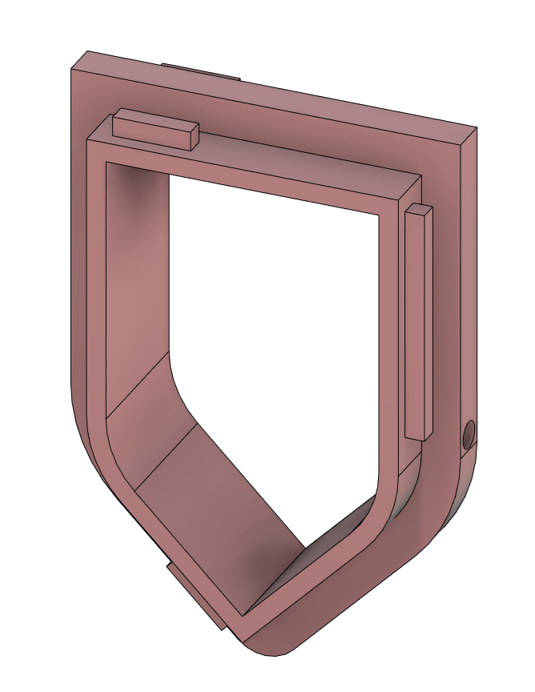

# Seventh report -- 9/12/2022

Task according to the Gantt chart :

* Simples designs impression + assembly

I have launched the other shell's print, il should be finished by monday. I have also designed the seals between the shells body and noses. Here is how it looks like :

The shells and noses have the same notches, so it should get in place.

I had launched them too, but the impression failed. I don't know why though.
