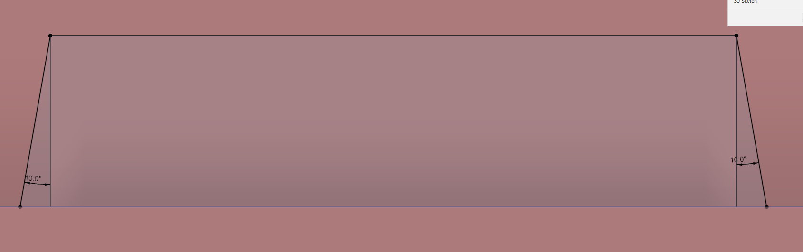
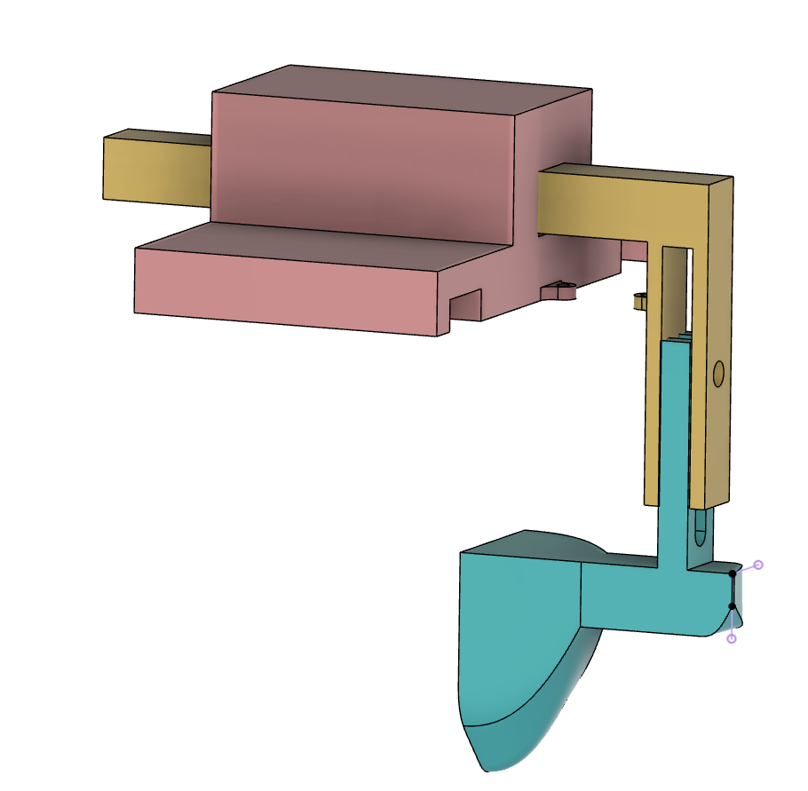

# Ninth report -- 9/12/2022

Task according to the Gantt chart :

* Simples designs impression + assembly

## Shell assembly

I finally managed to print the seals, ans have dedicated this session to the shell's assembly.
The problem is the seals.
I made them to fit in the shells, without any gap, but with an angle of 10°.

The black line and above is the shell, the rectangle in the grey surface and below is the seal.
So there should be enough space for the seal to fit in the shell, but it doesn't.
In fact, the problem isn't that the seal doesn't fit in, but that its supports doesn't want to get into the shell.
Since the seals are flexible, the supports bows themselves, compress themselves, and just lay next to the shell's hole without getting in, because of the pressure.

So I had to file the supports, and now the somehow fit in the shell. But there is still some space between the seal and the shell, and I don't know how to fix that.
Another problem is the weight of the assembled shell. It is almost 800g without the motors and the jetson nano case, that's way too much.
I will keep that for the moment, and I'll think about doing a thermoformed shell later.
Or I could go back to my shell without filling and only little circles, now that Xavier has parametrized the slicer correctly.

## Water drag test

I have met some professors of different disciplines, and I have discussed with them about how to test the water drag of the shell.
They came out with two possibilities : I could either make a numerical simulation, or I could make a physical test.

Since I have the 3d model, it shouldn't be hard to make a numerical simulation, but the software I was recommended is really hard to use, so I'll have to learn how to use it.

For the physical test, I was granted access to the water canal of the school, so I can use it. In fact, it is a good solution, because its flow is turbulent, and it will be the same in the sea.
But the maximum speed in the canal is around 20cm/s and it is not quite the speed of the boat.
Plus, the canal is around 5.5 cm wide, so testing the entire shell in it would induce side effects.

So I have printed a reduction of the shell.

Also, they don't have any way to measure drag, so I will have to make a device to measure it.
The first idea is to use a dynamometer, attached to the shell, but the shell would move all around, eventually turning the dynamometer, and the measurement would be wrong since we want the drag with a constant angle.

I made a design to measure the strenght applied on the dynamometer, while blocking the shell's rotation and movement.

The pink part is put over the canal, the yellow part slides on the pink part, and is attached to the blue part with an height fixed by a screw. The blue part is attached to the shell. The dynamometer would be between the pink and the yellow part.
